# JKANNEL

**A web control plane for Kannel/Kamex SMS gateways.**

JKANNEL gives a telecom operator one console for SMSC connections, routing, message
tracing, delivery reports, gateway configuration, alerting, reporting, customers and
audit — without hand-editing gateway config files or restarting the gateway to change
where traffic goes.

---

## What JKANNEL is (and is not)

JKANNEL is a **control plane**. The gateway engine — Kamex 1.8.3, a maintained Kannel
fork — remains the **data plane** and stays the sole owner of in-flight message state.
JKANNEL creates and deploys the engine's configuration, watches its binds, decides
routing, and records what happened; it never takes custody of the outbound queue. That
means a JKANNEL outage degrades management and visibility, not delivery. It also means
messages already inside the engine are visible only as per-bind counters and cannot be
moved individually — a deliberate, documented boundary with a supported workaround
(disable the bind, resend the affected traffic to a healthy one). The reasoning is in
[ADR-0008 — control-plane boundary](docs/adr/ADR-0008-control-plane-boundary.md).

Every gateway interaction crosses a generic **Engine Adapter**, so Kamex and upstream
Kannel are sibling adapters and modules branch on discovered *capabilities*, never on
engine names.

## Screenshots

All captured from a development stack with fake binds and no real traffic —
never from production. Subscriber numbers and message bodies are masked by
default in the product itself, and the SMSC identifiers shown here are
synthetic.

| Sign in | Operations dashboard | Reports & analytics |
|---|---|---|
| 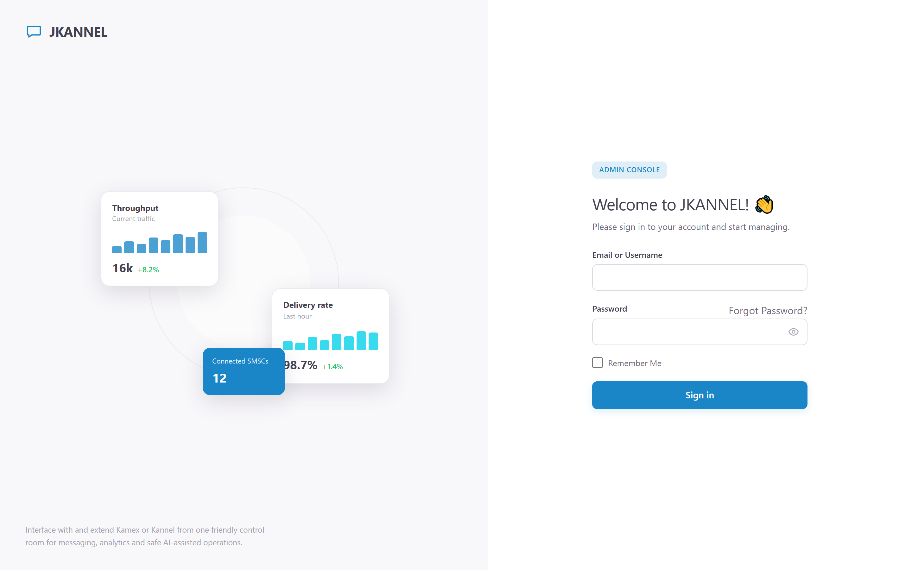 | 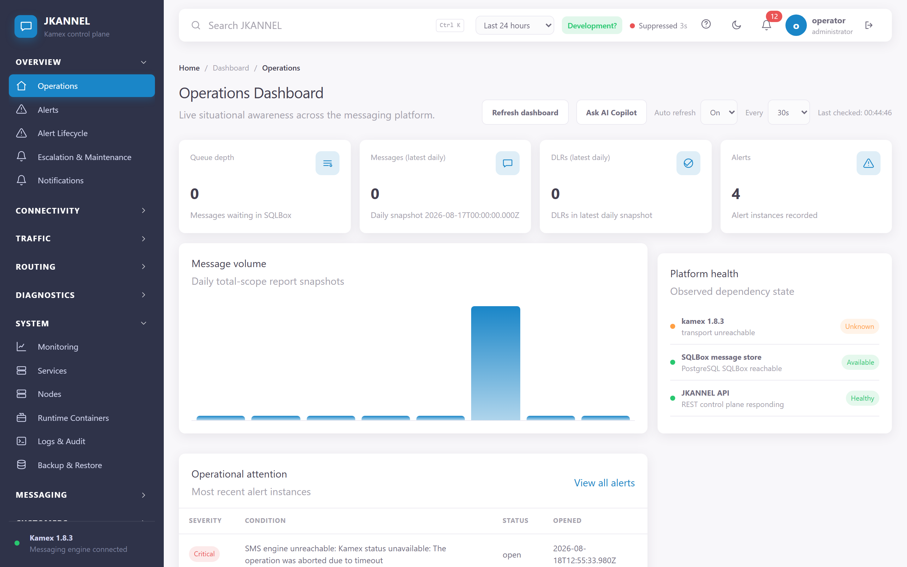 | 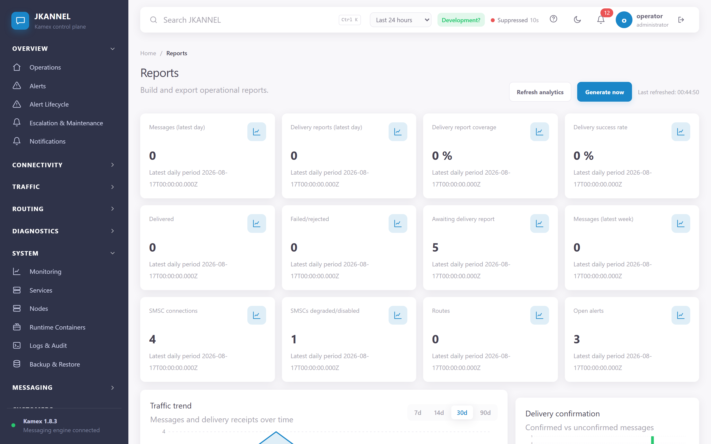 |

**System health** — every component the gateway depends on, which dependency
explains a failure, and the components nothing watches (counted apart from
healthy, never folded into it).

| Services board | Nodes | Runtime |
|---|---|---|
| 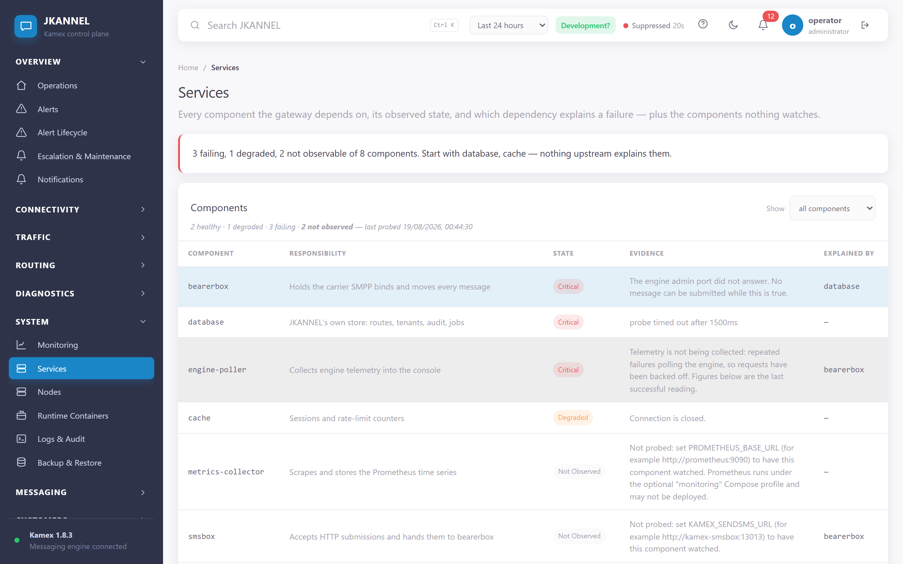 | 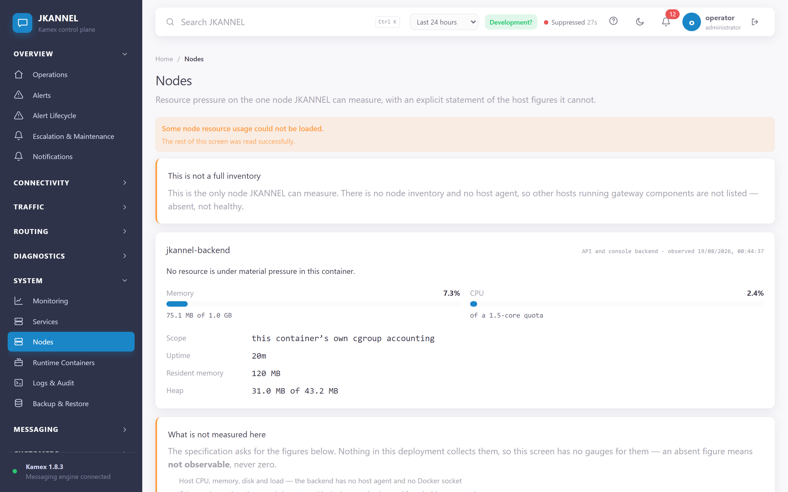 | 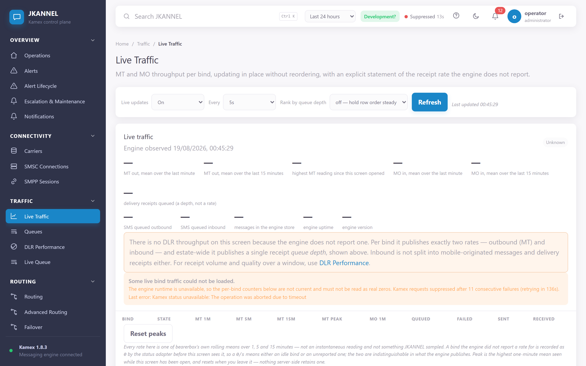 |

**Connectivity and routing**

| Carriers | SMSC connections | Routing |
|---|---|---|
| 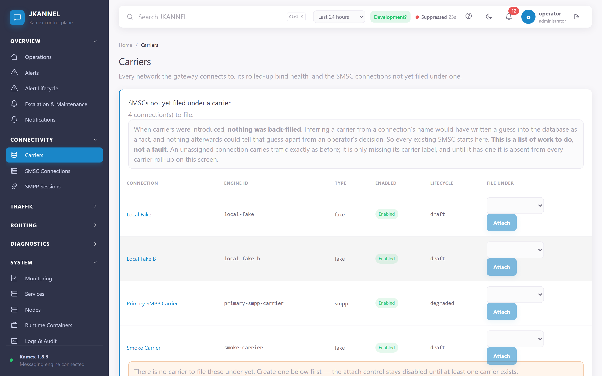 | 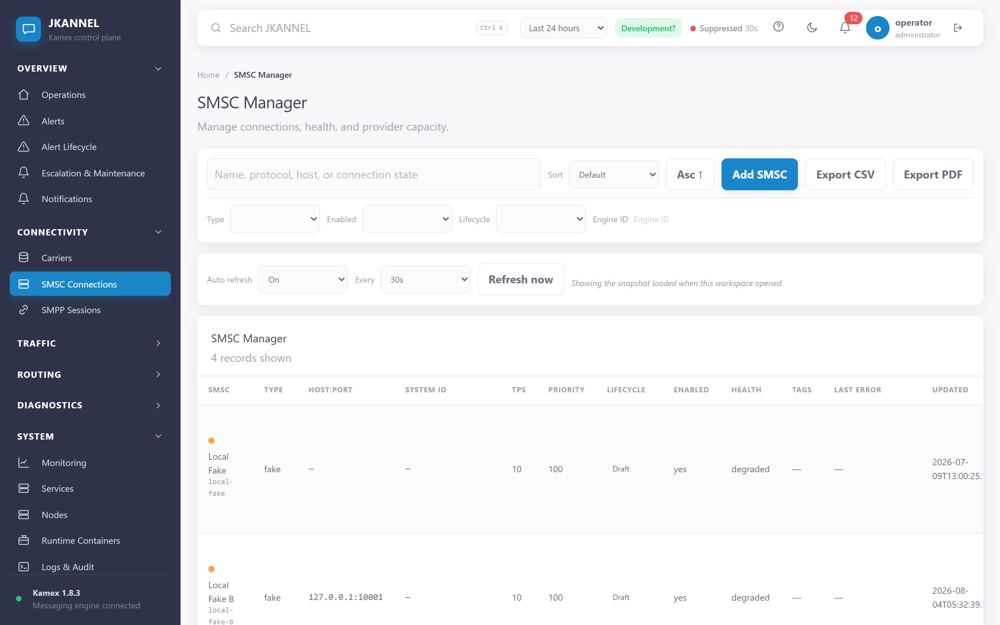 | 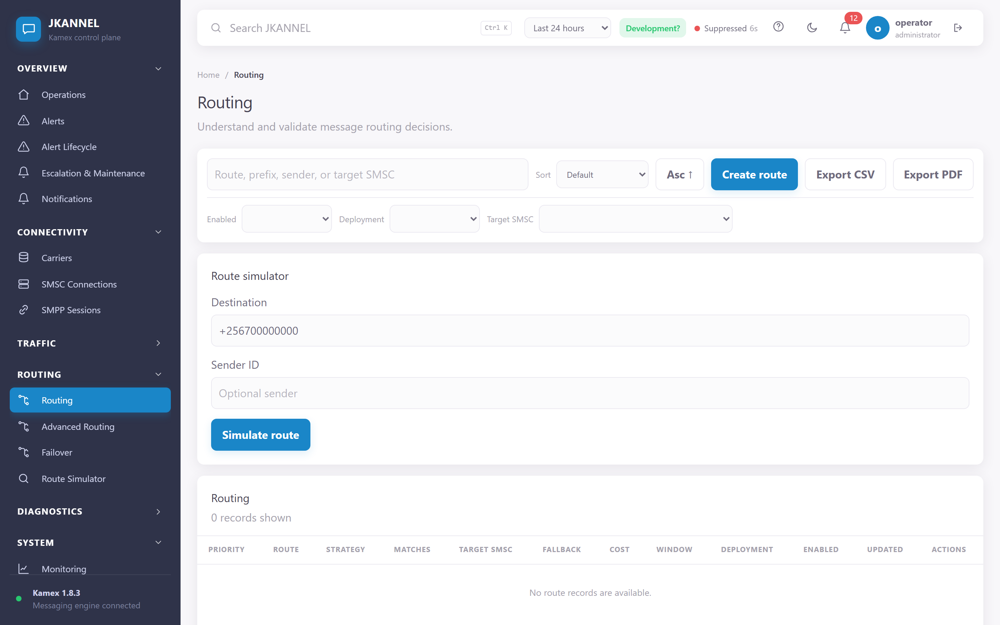 |

**Traffic and diagnostics** — the message grid is masked by default; seeing real
values needs the `messages.reveal` permission *and* a reasoned, time-limited,
audited window.

| Messages (masked) | Queues | Message trace |
|---|---|---|
| 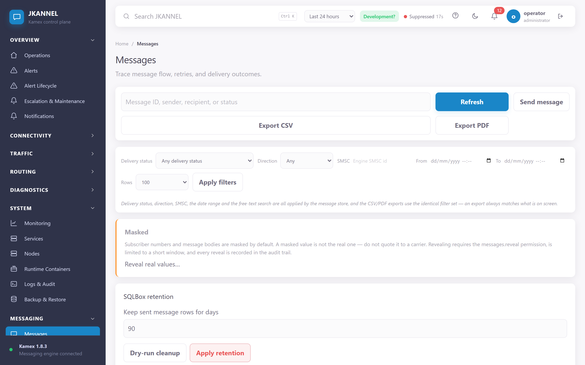 | 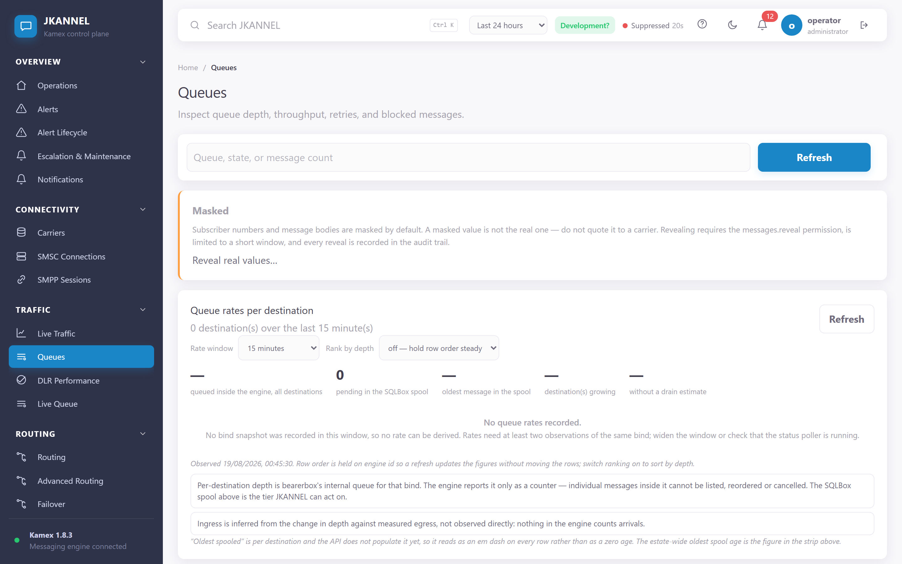 | 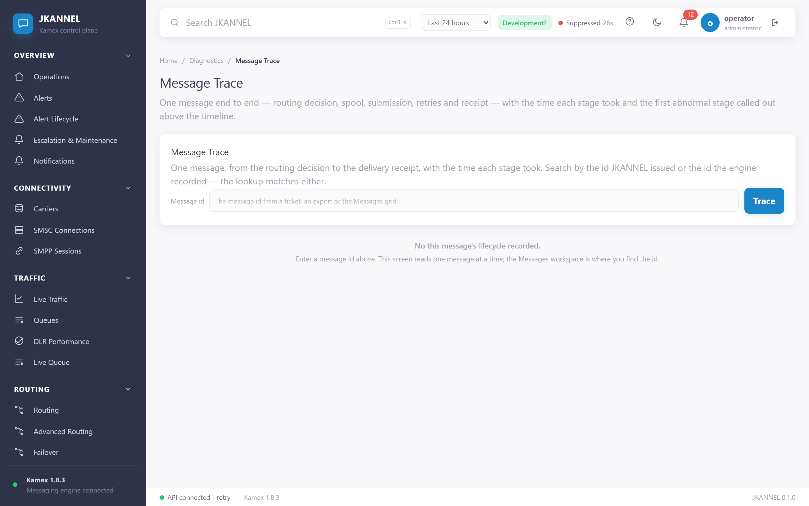 |

| Test tools | API reference |
|---|---|
| 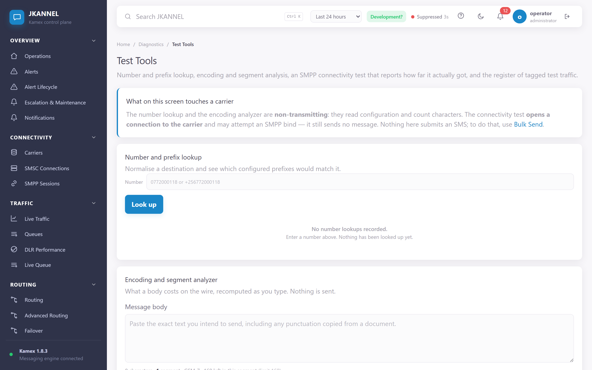 | 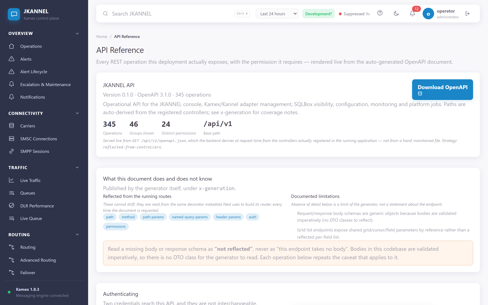 |

> Regenerate with `node e2e/screenshots.mjs` against a running local stack.

## What it does

The authoritative, evidence-checked capability list is **[FEATURES.md](FEATURES.md)** —
every entry there was verified by tracing that a non-test caller reaches it on a real
request path, and its "Not yet implemented" section is deliberately long and specific.
The summary:

| Area | What you get |
|---|---|
| **Messaging** | Send single, bulk or over the REST API; one transactional send pipeline (normalise → blocklist → route → entitlements → record → submit); message explorer with CSV/PDF export; replay, clone and requeue. |
| **Live Queue** | Per-bind status, queue depth, failures and throughput; start/stop/reconnect a *single* bind without restarting the gateway; reroute the pending spool; bulk-resend failed traffic to a healthy bind. |
| **Routing** | Static, prefix, country, operator and weighted routes; priority, least-cost, load-balance, round-robin and time-based strategies; health-aware failover; a resolve/preview that explains why a destination took a given bind; per-message decision audit. |
| **SMSC connections** | Full CRUD with the SMPP attribute set, enable/disable/reconnect against the live engine, bind-state polling and transition history. |
| **Configuration** | Generates a complete working gateway config from the database, with credentials emitted as secret *references*; immutable versions, diff, approval, atomic deploy, native validation, drift detection and automatic rollback on a failed health check. |
| **Monitoring & alerts** | Bind poller with anti-flap alerting, scheduled alert-rule evaluation, a full alert lifecycle (acknowledge, resolve, assign, suppress, reopen, close, comments), escalation policies with a deliverability check, maintenance windows, Prometheus metrics and an SMS-focused Grafana dashboard. |
| **Reporting** | KPI overview, traffic trends, per-SMSC and per-route breakdowns, hourly heatmap, latency/SLA percentiles, saved scheduled reports, CSV/PDF export throughout. |
| **Customers** | Accounts with quotas, prepaid credit and an append-only ledger, sender-ID approval — all **enforced on the send path**, atomically. |
| **API gateway** | API keys with one-time secret issuance, scope enforcement, per-key Redis rate limiting, IP/CIDR allowlists and a per-request audit log; auto-generated OpenAPI. |
| **Security** | RBAC on every endpoint with eight seeded roles and editable permission grants, PostgreSQL row-level security forced on all tenant tables, TOTP MFA, refresh-token family revocation, an enforced per-tenant password and session policy, and a database-enforced tamper-evident audit hash chain. |
| **Backup & DR** | Scheduled encrypted `pg_dump` backups with retention classes, integrity verification, restore into an isolated verification database, and local or S3-compatible offsite destinations. |

**Scale:** 39 API controllers · ~250 endpoints · 34 database migrations · 26 console
screens · 100 backend test suites (836 tests) · 18 frontend suites (112 tests).

### Known limits worth knowing before you plan around them

Read [FEATURES.md § Not yet implemented](FEATURES.md#not-yet-implemented) in full — but
note that it was written against commit `eefa320` and a later commit closed several of
the gaps it lists. The limits that still hold, and that surprise people most:

- **A fresh install pages nobody.** A default in-app channel is seeded, so alerts always
  reach the console — but no email, webhook or SMS destination exists until you add one.
  `GET /api/v1/monitoring/notifications/readiness` tells you where you stand.
- **No independent message store.** Every message read is a live query against the
  engine's SQLBox, so retention deletes engine rows rather than archiving them, and
  free-text search is an unindexed scan.
- **TLS is terminated upstream by default.** The shipped reverse proxy listens on plain
  HTTP by design and the certificate lives on your own edge — that is how the live
  deployment runs. An opt-in `tls` profile lets JKANNEL terminate it instead. See
  [`infrastructure/nginx/README.md`](infrastructure/nginx/README.md).
- **A generated configuration has never bound to a real carrier.** The render is
  complete and natively validated, but the create → deploy → **bind** chain is unproven
  because it needs carrier-side IP allow-listing.
- **Some workflows have no console screen.** Customer quotas and credit, API-key
  issuance and notification channels are API-only. The guides give you the `curl`.
- **Plugins register and validate but do not execute** — there is no plugin runtime.

Password hashing is **scrypt, not Argon2id**, and notification-channel secrets are
stored and returned in plaintext to holders of `alerts.view`. Both are documented
rather than fixed.

## Architecture at a glance

```
                    your edge (TLS)                 ┌──────────────────────────┐
  browser ──HTTPS──▶ system nginx ──HTTP──▶ reverse-proxy (nginx, :8080)
                                                    │  /      → frontend :5173 │
                                                    │  /api/  → backend  :3000 │
                                                    └──────────────────────────┘
                                                                 │
        ┌────────────────────────────────────────────────────────┴──────────┐
        │                                                                   │
   frontend (Vue 3 + Vite)                                    backend (NestJS + TypeScript)
                                                                            │
                              ┌─────────────────────────────────────────────┼──────────────┐
                              │                     │                       │              │
                        PostgreSQL              Redis                Engine Adapter    Prometheus
                     (system of record,   (rate limits,                    │            /metrics
                      forced RLS)          idempotency,                    │
                                           throttling)                     ▼
                                                              ┌────────────────────────┐
                                                              │  Kamex 1.8.3 (engine)  │
                                                              │  bearerbox ─ smsbox    │
                                                              │  sqlbox ─ validator    │
                                                              └───────────┬────────────┘
                                                                          ▼
                                                                    SMPP carriers
```

- **PostgreSQL** is the system of record. Tenant isolation is enforced *in the database*
  by forced row-level security, and the API connects as a non-owner role.
- **SQLBox** (`send_sms` / `sent_sms`) is the engine's own message store. JKANNEL reads
  and writes it as an external, engine-owned source; it does not fork the data into
  tables of its own.
- **Redis** backs rate limiting, idempotency and auth throttling. It is optional for
  liveness — if it is down the limiters fail open and `/health` says so.

Stack: NestJS/TypeScript · Vue 3 + Vite · PostgreSQL · Redis · Docker Compose ·
Kamex/Kannel behind a generic Engine Adapter.

## Quick start

Requires Docker with the Compose plugin.

```bash
cp .env.example .env        # then fill in the replace-with-… values

docker compose --profile engine-kamex up -d --build

# Migrations run automatically on backend boot (MIGRATIONS_ON_BOOT=true).
# To apply them by hand instead:
docker compose exec backend npm run migrate

# Create the first operator (password must be at least 12 characters)
DEV_OPERATOR_PASSWORD=change-me-please \
  docker compose exec -e DEV_OPERATOR_PASSWORD backend npm run provision:dev-operator
```

Then open the console:

| Surface | URL |
|---|---|
| **Web console** (direct) | http://127.0.0.1:5173 |
| Web console (through the proxy) | http://127.0.0.1:8080 |
| Backend API | http://127.0.0.1:3000/api/v1 |
| Health | http://127.0.0.1:3000/api/v1/health |
| OpenAPI | http://127.0.0.1:3000/api/v1/openapi.json |
| Prometheus metrics | http://127.0.0.1:3000/api/v1/metrics |
| Prometheus (`--profile monitoring`) | http://127.0.0.1:9090 |
| Grafana (`--profile monitoring`) | http://127.0.0.1:3001 |

> **Use `127.0.0.1`, not `localhost`.** On Windows and macOS the browser resolves
> `localhost` to IPv6 (`::1`) first, but Docker publishes on IPv4, so
> `http://localhost:3000` API calls fail with *"Failed to fetch"*.

Sign in with tenant `default`, username `operator`, and the password you just set. The
login form labels the first field **"Email or Username"**, but there is no email column
in the users table — **enter the username**.

New to the console? Start with the
[user guides](docs/user-guides/README.md).

### Compose profiles

| Profile | Adds |
|---|---|
| *(none)* | postgres, redis, backend, frontend, reverse-proxy |
| `engine-kamex` | Kamex bearerbox, smsbox, sqlbox and the native config validator |
| `monitoring` | Prometheus + Grafana |
| `observability` | Loki + Promtail log aggregation |
| `workers` | Split-out scheduler and backup-service workers |
| `watchdog` | Container watchdog |
| `tls` | A second nginx that terminates TLS itself, instead of upstream |

`docker-compose.ha.yml` is a separate high-availability overlay (PostgreSQL streaming
replication, Redis Sentinel, a rolling-update backend replica). It is config-validated
but has never been drilled on real hosts.

## Configuration

All configuration is environment variables; `.env.example` is the annotated reference.
The ones you cannot skip:

| Variable | Why it matters |
|---|---|
| `POSTGRES_PASSWORD`, `POSTGRES_APP_PASSWORD`, `POSTGRES_AUTH_PASSWORD` | Three distinct roles: owner, the non-owner application role, and the least-privilege pre-login lookup role. |
| `AUTH_ACCESS_TOKEN_KEY`, `AUTH_REFRESH_TOKEN_KEY` | Separate signing keys per token type, ≥32 random bytes each. |
| `FRONTEND_ORIGIN` | Comma-separated CORS allowlist. A browser origin that is not listed cannot log in. |
| `VITE_API_BASE_URL` | Where the SPA sends API calls. Set it to your public origin + `/api` when running behind a proxy. |
| `VITE_ALLOWED_HOSTS` | Hostnames the Vite dev server will answer for. Behind a proxy it receives the **public** hostname and returns 403 unless that name is listed. |
| `KAMEX_ADMIN_PASSWORD`, `KAMEX_STATUS_PASSWORD`, `KAMEX_SENDSMS_PASSWORD`, `KAMEX_VALIDATOR_TOKEN` | Engine admin, status, sendsms and native-validator credentials. |
| `BACKUP_ENCRYPTION_KEY` | Mandatory. Backups refuse to run without a real key — there is no weak fallback. |
| `SMTP_URL` | Without it, email notification channels report "unavailable" rather than pretending to send. |

Secrets referenced by a generated gateway configuration are emitted as `${VAR}`
placeholders, never literals. The generate response lists them as `requiredSecrets`;
**those variables must exist in the engine container's environment** or the engine will
start with an unresolved placeholder. See
[Connecting an SMSC](docs/user-guides/02-connecting-an-smsc.md).

### The frontend is a Vite dev server

The `frontend` container runs `vite --host 0.0.0.0`, not a static build behind nginx.
It is deployable behind a reverse proxy, but two consequences follow:

1. Vite performs a host check. Set `VITE_ALLOWED_HOSTS` to your public hostname or the
   proxy gets a 403.
2. The HMR websocket is proxied through `/`; the shipped nginx config already handles
   the upgrade.

### TLS

The shipped `reverse-proxy` is HTTP-only **by design** — the "TLS terminated upstream"
topology, where a system nginx (or any other edge) holds the certificate and proxies
cleartext to `PROXY_HTTP_PORT`. To have JKANNEL terminate TLS itself, use the
profile-gated `reverse-proxy-tls` service. Both topologies are documented in
[`infrastructure/nginx/README.md`](infrastructure/nginx/README.md).

## Running the tests

```bash
# Backend — 100 suites / 836 tests
cd backend && npm ci && npm test
npm run test:cov            # with the coverage gate
npm run typecheck && npm run lint

# Backend integration (needs a live database; skips honestly without one)
npm run test:integration

# Frontend — 18 suites / 112 tests
cd frontend && npm ci && npm test
npm run test:cov && npm run typecheck && npm run lint

# End-to-end (Playwright, against a running stack)
cd e2e && npm ci && npx playwright test

# Load / soak harness
cd perf && npm ci && node run.js --help
```

CI (`.github/workflows/ci.yml`) runs five jobs — backend, frontend, compose validation,
migration checking and a dependency audit. All block except the security job, which is
`continue-on-error` until the existing findings clear.

Be honest about what the e2e count means: of 40 runtime cases, 26 are a single
navigation loop and 5 are genuinely mutating workflows. See
[`project/IMPLEMENTATION_VERIFICATION.md` § 4](project/IMPLEMENTATION_VERIFICATION.md).

## Documentation

| Where | What |
|---|---|
| **[docs/user-guides/](docs/user-guides/README.md)** | **Task-oriented operator manuals.** Start here if you are running the platform. |
| [FEATURES.md](FEATURES.md) | Verified capability list, including what is *not* built. |
| [project/IMPLEMENTATION_VERIFICATION.md](project/IMPLEMENTATION_VERIFICATION.md) | Independent, evidence-by-file verification of every claim above. |
| [project/SPEC_GAP_ANALYSIS.md](project/SPEC_GAP_ANALYSIS.md) | The audit that drove the remediation waves, and the build order it recommended. |
| [progress/requirements-traceability.md](progress/requirements-traceability.md) | Per-requirement status ledger, with its correction notice. |
| [docs/adr/](docs/adr/) and [decisions/](decisions/) | Architecture decision records. |
| [docs/specifications/](docs/specifications/) | Canonical engineering specifications (platform, api, database, engine, ui, security, operations, ai, sdk). |
| [docs/domain/](docs/domain/) | Product vision, scope, success criteria and the telecommunications domain model. |
| [docs/handbook/](docs/handbook/) | Engineering constitution, documentation and ADR standards. |
| [project/JKANNEL_DOCUMENTATION_CATALOG.md](project/JKANNEL_DOCUMENTATION_CATALOG.md) | Ownership index for every canonical document. |
| [project/PROJECT_STATE.md](project/PROJECT_STATE.md) · [project/CHANGELOG.md](project/CHANGELOG.md) · [project/ROADMAP.md](project/ROADMAP.md) | Living project state, dated history and phase roadmap. |

## Status

Actively developed. Six remediation waves closed the three integration voids that made
earlier versions a console over disconnected parts: the configuration generator now
reads real SMSC definitions, routing is on the send path, and alert rules are actually
evaluated. An independent verification of that work found 10 of 20 audited gaps closed,
7 partially closed and 3 open.

A follow-up commit then closed most of the remainder — role and permission
administration with eight seeded roles, the full alert lifecycle, message date-range
search with export parity and segment counts, a real SMPP bind test and a genuine
reconnect cycle, an S3 backup destination, container resource limits, an opt-in TLS
profile, and a queryable log endpoint — with console screens for the Roles admin, Alert
Lifecycle and Log Explorer following shortly after.

**`FEATURES.md` and the verification report predate that work and now understate the
product.** Read them with their date in mind; `/api/v1/openapi.json` is generated from
the live route table and is never stale.

Four release gates remain **outstanding evidence, not code**, and are not fabricated
anywhere in this repository: a live carrier SMPP bind (blocked on carrier-side IP
allow-listing of the deployment's egress IP), an independent penetration test, a
production-scale soak, and a multi-node HA failover drill with measured RPO/RTO.

## Licence

See [LICENSE.md](LICENSE.md). Kamex/Kannel licensing is in
[LICENSE.kannel](LICENSE.kannel).
