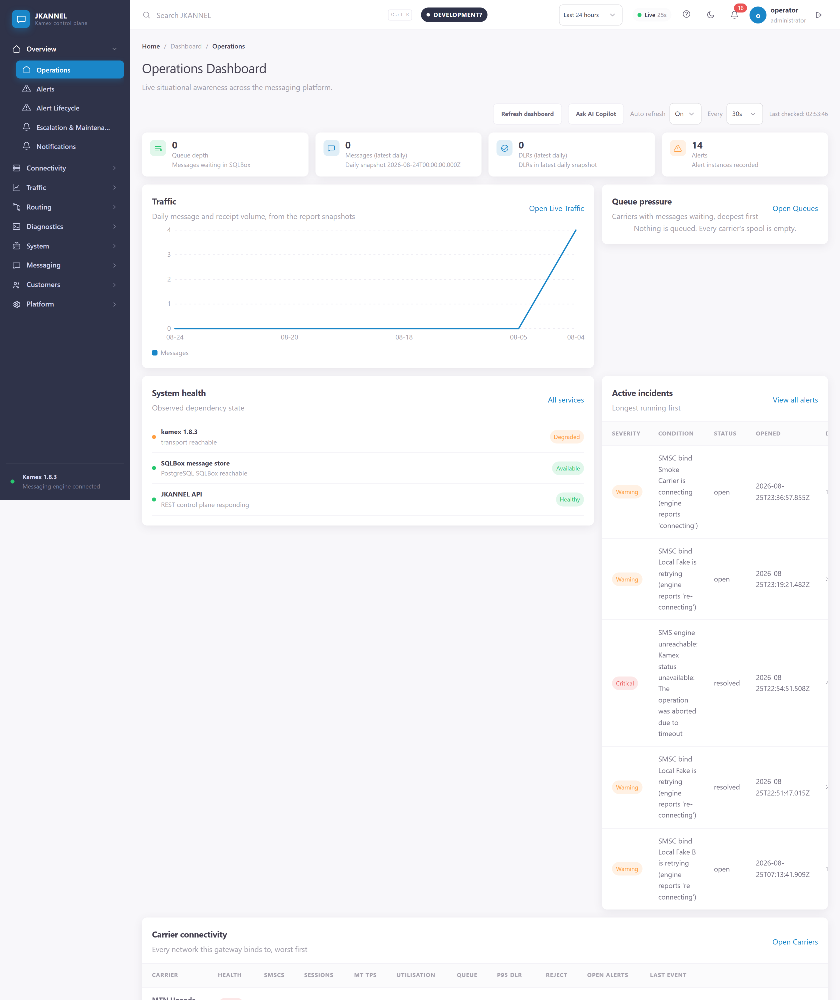
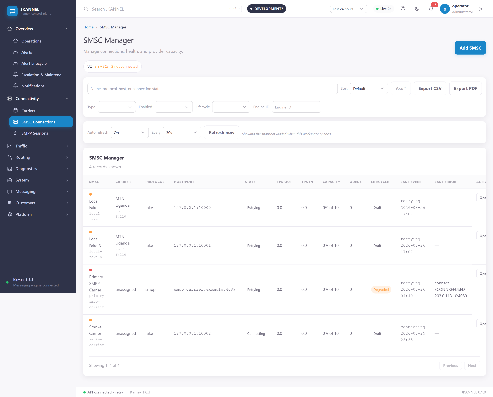
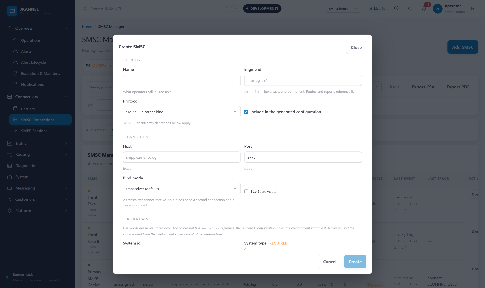
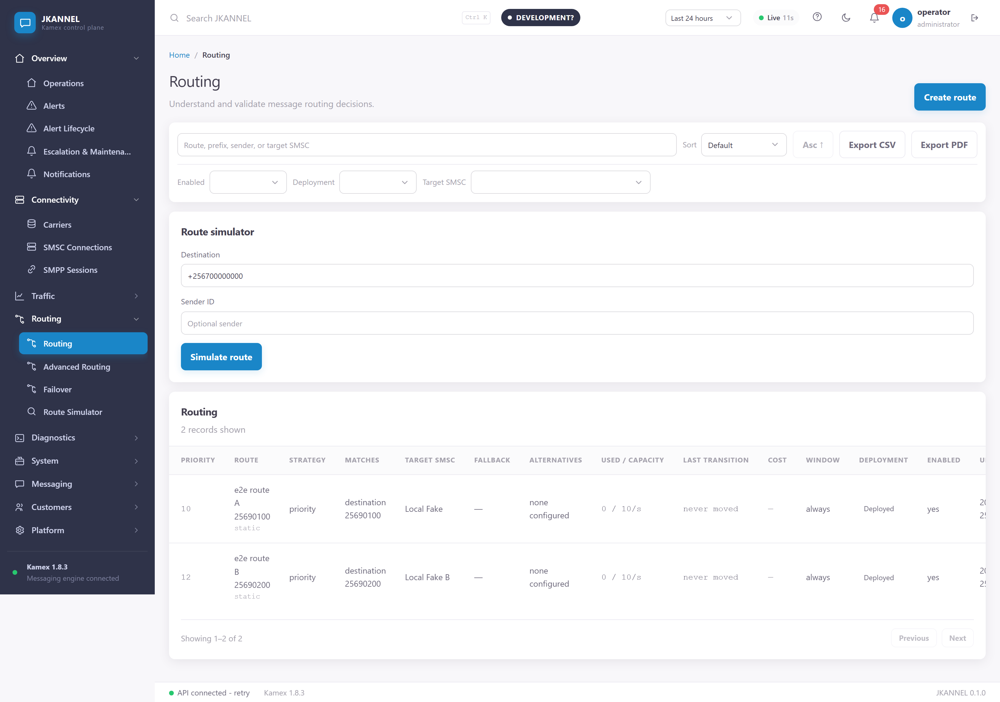
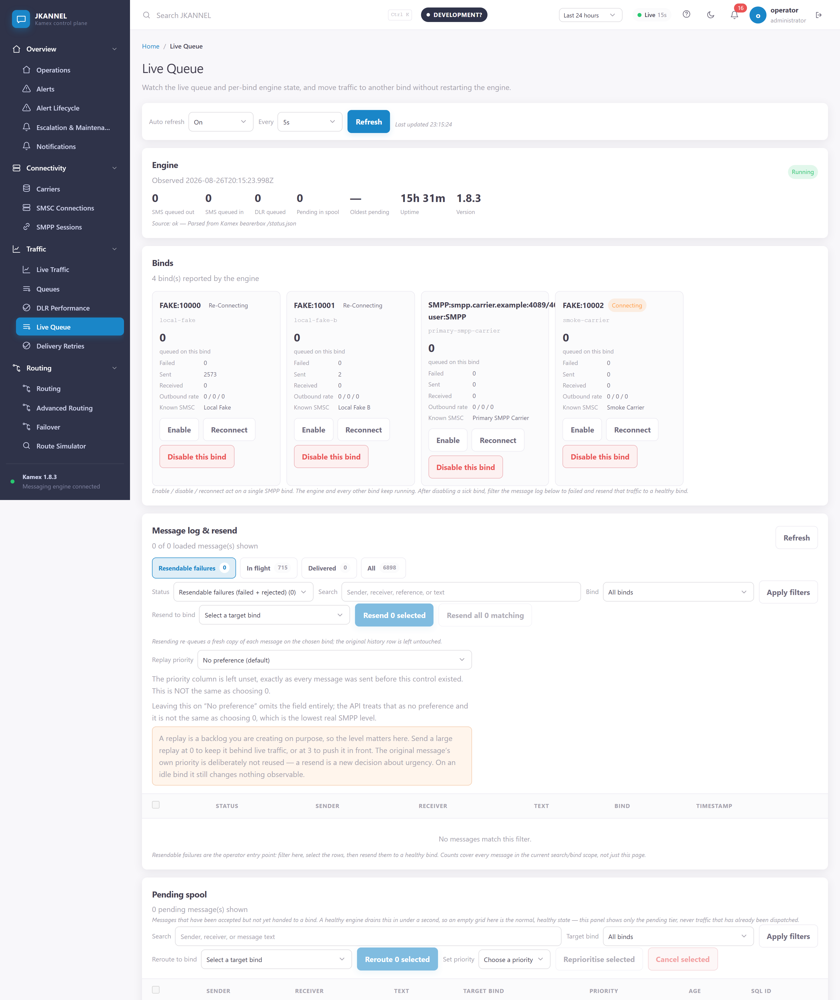
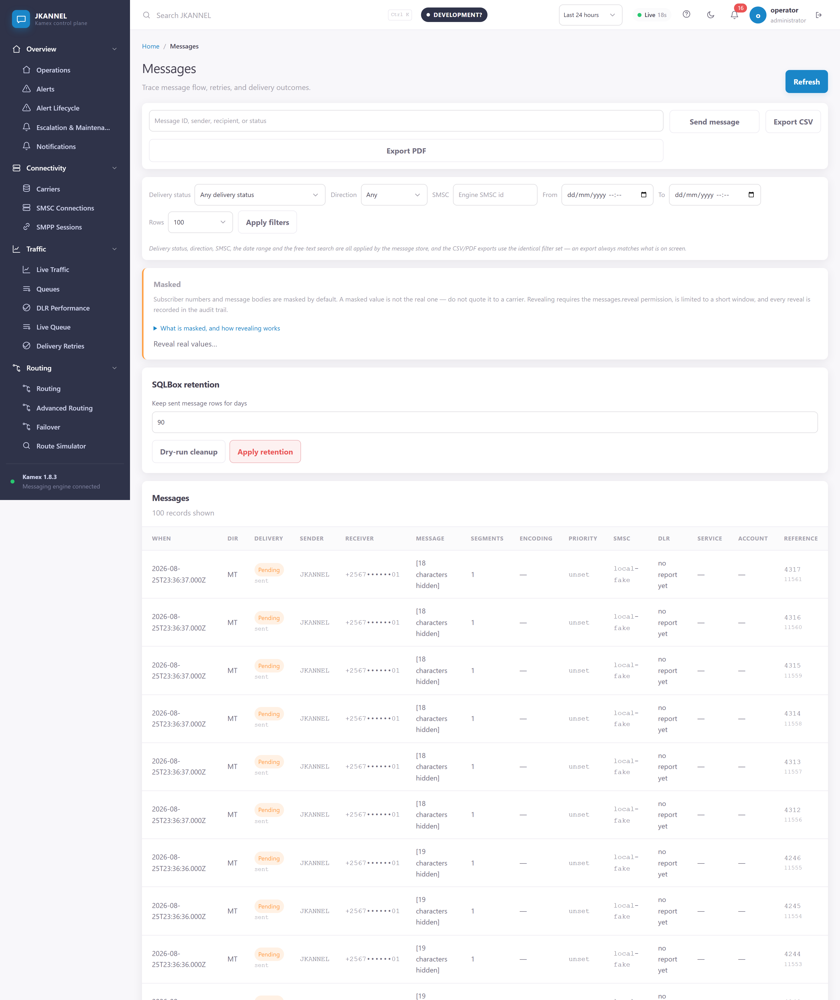
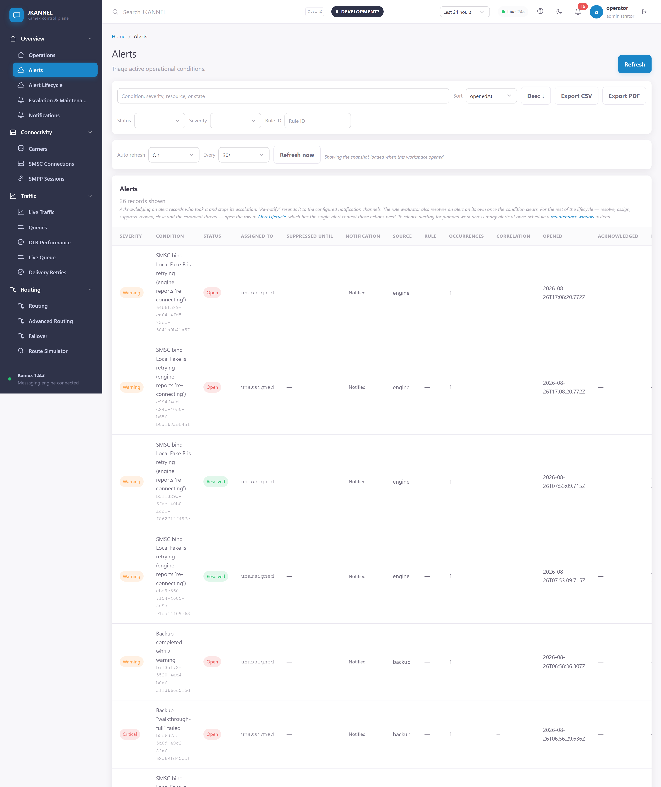
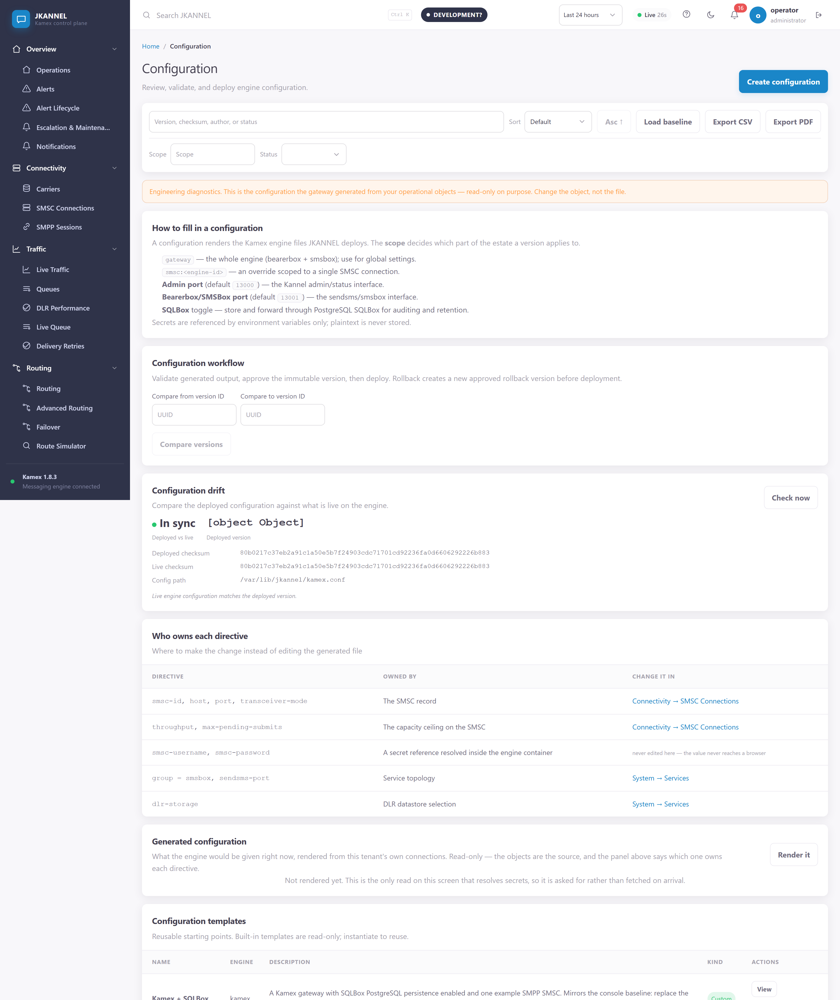
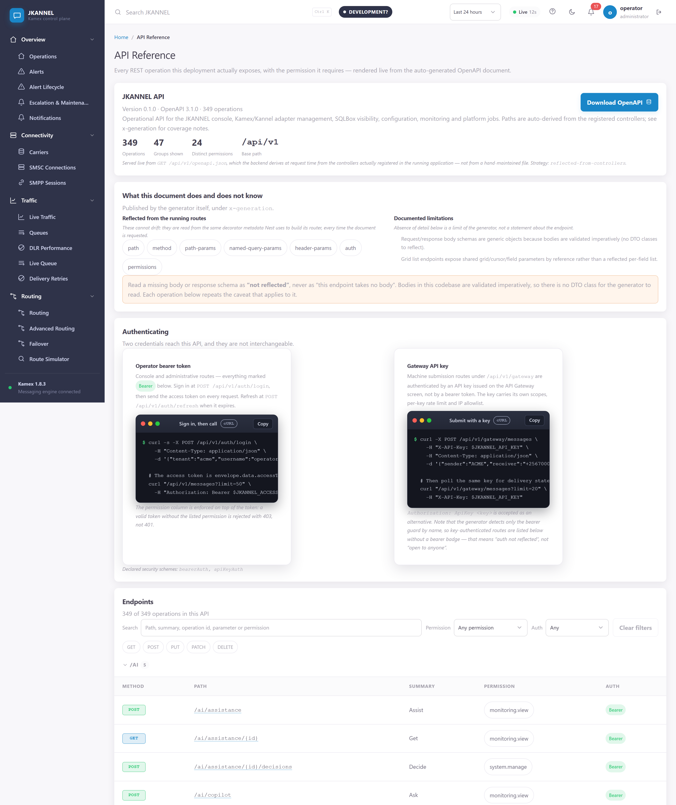

# JKANNEL

**A web control plane for Kannel/Kamex SMS gateways.**

JKANNEL gives a telecom operator one console for SMSC connections, routing, message
tracing, delivery reports, gateway configuration, alerting, reporting, customers and
audit — without hand-editing gateway config files or restarting the gateway to change
where traffic goes.

---

## What JKANNEL is (and is not)

JKANNEL is a **control plane**. The gateway engine — Kamex 1.8.3, a maintained Kannel
fork — remains the **data plane** and stays the sole owner of in-flight message state.
JKANNEL creates and deploys the engine's configuration, watches its binds, decides
routing, and records what happened; it never takes custody of the outbound queue. That
means a JKANNEL outage degrades management and visibility, not delivery. It also means
messages already inside the engine are visible only as per-bind counters and cannot be
moved individually — a deliberate, documented boundary with a supported workaround
(disable the bind, resend the affected traffic to a healthy one). The reasoning is in
[ADR-0008 — control-plane boundary](docs/adr/ADR-0008-control-plane-boundary.md).

Every gateway interaction crosses a generic **Engine Adapter**, so Kamex and upstream
Kannel are sibling adapters and modules branch on discovered *capabilities*, never on
engine names.

## Screenshots

Captured from a development stack: the binds are Kannel's own `fake` SMSCs, the traffic
is synthetic, and any real carrier hostname is replaced **in the DOM before the shutter**
by `scripts/readme-shots.mjs`. Regenerate them with:

```bash
# Copy into frontend/ or e2e/ first — ESM resolves @playwright/test relative to
# the script file, and only those two packages have it installed.
cp scripts/readme-shots.mjs frontend/.shots.mjs && (cd frontend && node .shots.mjs)
```

The replacement list lives in the gitignored `.env` as `SHOT_REDACTIONS`, never in the
script — a redaction list that names the hostname it protects publishes the hostname it
protects. **The script refuses to run if it cannot find that list**, because from inside
it "this deployment has no carrier configured" and "the list did not load" look
identical, and only one of those is safe to guess at. Pass
`SHOT_ALLOW_NO_REDACTION=true` to say the former deliberately.

Note what this does and does not guarantee. The check runs while the page is still
text: it replaces the values in the DOM and refuses to continue if any survives.
`scripts/secret-scan.mjs` **cannot** back it up — a PNG holds compressed pixels, so a
hostname *drawn* into an image is not the byte sequence anywhere in the file, and the
scan will report a leaking screenshot clean. Both of those were learned the hard way.

### Operations dashboard



Live situational awareness in one screen. Every figure is read from the running
engine at request time — and a value the engine did not report reads `unknown`
rather than `0`. The distinction matters operationally: an unobserved bind is
not an idle one, and a console that prints a confident zero for something it
never measured will get somebody paged for the wrong reason.

### SMSC connections



The carrier-facing connections, scoped by market. **State is what the engine
observed, not what the configuration asked for** — a bind an operator enabled
and the carrier has not accepted shows as retrying, with the connection error
the engine reported. Clicking a row opens the connection; Test and Reconnect are
on the row because they are diagnostic and safe.

### Connection settings, point and click



**This is the screen that replaces `kannel.conf`.** All 38 settable attributes
have a control, grouped the way a carrier's onboarding sheet is laid out and
collapsed until wanted, so a working SMPP bind needs only the first two groups.

Three things make it easier than the file rather than merely equal to it:

- **Only what applies is shown.** A `fake` SMSC has no system-id; an HTTP one
  has no bind mode. The file lists every directive whether it applies or not,
  and working out which ones do is most of the work of reading it.
- **Every field names its directive.** `address-range`, `max-pending-submits`,
  `enquire-link-interval` — so somebody who knows Kannel finds what they know,
  and somebody who does not can search the Kannel manual for the exact word.
- **Blank means absent.** A setting left empty is omitted from the generated
  file entirely, so the engine's own default applies. Placeholders show what
  that default is; they are never pre-filled, because a number typed in is a
  number pinned into the config.

Passwords are never stored. The record holds a `secret://` reference and the
generated config holds the environment variable it derives to — and the form
tells you which variable that is and whether it is currently set, which used to
be knowledge you only got from a failed bind.

### Carrier routing



Routes are drafted, validated, then deployed — and **only a deployed route
decides where a message goes**. The simulator resolves against the same deployed
set the send path uses, and names any matching route that is not deployed rather
than silently predicting a winner that cannot win.

### Live queue



The engine spool as it drains. A healthy gateway empties this in under a second,
so an empty queue is the normal state rather than evidence that nothing was
sent — the screen says so, because the opposite reading causes real incidents.

### Message log and trace



Every submission with its delivery outcome. Recipient numbers and message bodies
are **masked by default**; revealing them needs the `messages.reveal` permission
*and* a reasoned, time-limited, audited window. Opening a row shows the full
trace — segments, encoding, and the engine events behind the status — in a sheet,
so the log keeps its place behind it.

### Alerts



Operational alerts with their lifecycle: acknowledged, assigned, suppressed or
resolved — and whether anybody was actually notified, which is a different
question from whether the alert fired and the one that matters at 3am.

### Engine configuration



Configuration is generated from the database, validated by a **real bearerbox
parse in an isolated container**, approved as an immutable version, and only then
deployed atomically. A failed post-deploy health check rolls back automatically.

### API reference



The console is one client of the API, not a privileged one. Every operation it
performs is documented here with a runnable example, so anything you can do by
pointing and clicking you can also script.

## What it does

The authoritative, evidence-checked capability list is **[FEATURES.md](FEATURES.md)** —
every entry there was verified by tracing that a non-test caller reaches it on a real
request path, and its "Not yet implemented" section is deliberately long and specific.
The summary:

| Area | What you get |
|---|---|
| **Messaging** | Send single, bulk or over the REST API; one transactional send pipeline (normalise → blocklist → route → entitlements → record → submit); message explorer with CSV/PDF export; replay, clone and requeue. |
| **Live Queue** | Per-bind status, queue depth, failures and throughput; start/stop/reconnect a *single* bind without restarting the gateway; reroute the pending spool; bulk-resend failed traffic to a healthy bind. |
| **Routing** | Static, prefix, country, operator, weighted and **wildcard** routes (see below); priority, least-cost, load-balance, round-robin and time-based strategies; health-aware failover; a resolve/preview that explains why a destination took a given bind; per-message decision audit. |
| **SMSC connections** | Every one of the 38 settable attributes has a control — no config file, no curl — grouped as a carrier onboarding sheet and each field naming the `kannel.conf` directive it becomes. Enable/disable/reconnect against the live engine, bind-state polling and transition history. |
| **Configuration** | Generates a complete working gateway config from the database, with credentials emitted as secret *references*; immutable versions, diff, approval, atomic deploy, native validation, drift detection and automatic rollback on a failed health check. |
| **Monitoring & alerts** | Bind poller with anti-flap alerting, scheduled alert-rule evaluation, a full alert lifecycle (acknowledge, resolve, assign, suppress, reopen, close, comments), escalation policies with a deliverability check, maintenance windows, Prometheus metrics and an SMS-focused Grafana dashboard. |
| **Reporting** | KPI overview, traffic trends, per-SMSC and per-route breakdowns, hourly heatmap, latency/SLA percentiles, saved scheduled reports, CSV/PDF export throughout. |
| **Customers** | Accounts with quotas, prepaid credit and an append-only ledger, sender-ID approval — all **enforced on the send path**, atomically. |
| **API gateway** | API keys with one-time secret issuance, scope enforcement, per-key Redis rate limiting, IP/CIDR allowlists and a per-request audit log; auto-generated OpenAPI. |
| **Security** | RBAC on every endpoint with eight seeded roles and editable permission grants, PostgreSQL row-level security forced on all tenant tables, TOTP MFA, refresh-token family revocation, an enforced per-tenant password and session policy, and a database-enforced tamper-evident audit hash chain. |
| **Backup & DR** | Scheduled encrypted `pg_dump` backups with retention classes, integrity verification, restore into an isolated verification database, and local or S3-compatible offsite destinations. |

The **wildcard** match type deserves a line of its own, because it is the one an SMS
operator writes constantly and it is easy to get subtly wrong:

```
25677* | 25678* | 25676* | 25679*      all MTN Uganda, as one rule

  *   any run of characters, including none
  #   exactly one digit
  $   exactly one letter
  |   alternation between whole patterns
```

Everything outside those four characters is escaped, so `.` is a literal dot and a
pattern cannot become a regex by accident or hang the send path. Spaces around the
separator are trimmed — written without that, `25677* | 25678*` silently matched only
its first branch and reported no problem, which is the worst failure a routing rule has.

**Scale:** 47 API controllers · 353 endpoints · 52 database migrations (through `054`) ·
50 console screens · 175 backend test suites (2,052 tests) · 61 frontend suites
(698 tests).

Every figure above is countable from the repository rather than remembered:
`find backend/src -name '*.controller*.ts' ! -name '*.spec.ts'`,
`scripts/route-shadow-audit.mjs` (which walks every route), `ls database/migrations/*.up.sql`,
`docs/route-smoke.json`, and the two test runners. They were last recounted on
2026-08-27, and the previous set had drifted by roughly a factor of two.

### Known limits worth knowing before you plan around them

Read [FEATURES.md § Not yet implemented](FEATURES.md#not-yet-implemented) in full. It is
re-verified by `scripts/features-verify.mjs`, which probes each claim against the running
code rather than trusting the prose — at the last run, 11 of the listed gaps were real,
5 had since been built, and 4 were awaiting evidence rather than code. The limits that
still hold, and that surprise people most:

- **A fresh install pages nobody.** A default in-app channel is seeded, so alerts always
  reach the console — but no email, webhook or SMS destination exists until you add one.
  `GET /api/v1/monitoring/notifications/readiness` tells you where you stand.
- **No independent message store.** Every message read is a live query against the
  engine's SQLBox, so retention deletes engine rows rather than archiving them, and
  free-text search is an unindexed scan.
- **TLS is terminated upstream by default.** The shipped reverse proxy listens on plain
  HTTP by design and the certificate lives on your own edge — that is how the live
  deployment runs. An opt-in `tls` profile lets JKANNEL terminate it instead. See
  [`infrastructure/nginx/README.md`](infrastructure/nginx/README.md).
- **A generated configuration has never bound to a real carrier.** As of 2026-08-27 the
  chain is proven up to the last link: a carrier SMPP group is generated from the
  database, natively validated by a real bearerbox, deployed, and *held open by the
  running engine*, which reports the bind as `re-connecting` and retries every ten
  seconds. What has never happened is the TCP connection succeeding — the carrier has
  not allow-listed the deployment's egress address, so `Couldn't connect to server` is
  as far as it gets. Everything between the console and the engine is exercised; the
  bind handshake, DLR correlation and throughput shaping against a real ESME are not.
- **Some workflows have no console screen.** Customer quotas and credit, API-key
  issuance and notification channels are API-only. The guides give you the `curl`.
- **Plugins register and validate but do not execute** — there is no plugin runtime.

Password hashing is **scrypt, not Argon2id**, and notification-channel secrets are
stored and returned in plaintext to holders of `alerts.view`. Both are documented
rather than fixed.

## Architecture at a glance

```
                    your edge (TLS)                 ┌──────────────────────────┐
  browser ──HTTPS──▶ system nginx ──HTTP──▶ reverse-proxy (nginx, :8080)
                                                    │  /      → frontend :5173 │
                                                    │  /api/  → backend  :3000 │
                                                    └──────────────────────────┘
                                                                 │
        ┌────────────────────────────────────────────────────────┴──────────┐
        │                                                                   │
   frontend (Vue 3 + Vite)                                    backend (NestJS + TypeScript)
                                                                            │
                              ┌─────────────────────────────────────────────┼──────────────┐
                              │                     │                       │              │
                        PostgreSQL              Redis                Engine Adapter    Prometheus
                     (system of record,   (rate limits,                    │            /metrics
                      forced RLS)          idempotency,                    │
                                           throttling)                     ▼
                                                              ┌────────────────────────┐
                                                              │  Kamex 1.8.3 (engine)  │
                                                              │  bearerbox ─ smsbox    │
                                                              │  sqlbox ─ validator    │
                                                              └───────────┬────────────┘
                                                                          ▼
                                                                    SMPP carriers
```

- **PostgreSQL** is the system of record. Tenant isolation is enforced *in the database*
  by forced row-level security, and the API connects as a non-owner role.
- **SQLBox** (`send_sms` / `sent_sms`) is the engine's own message store. JKANNEL reads
  and writes it as an external, engine-owned source; it does not fork the data into
  tables of its own.

  Two properties of it are worth knowing before you operate this, because both fail
  silently and both were found the hard way. SQLBox opens **two** connections to
  bearerbox, and the one that drains `send_sms` **does not retry** — if it cannot
  resolve or reach bearerbox the instant it starts, that thread terminates for the life
  of the process while the other connects seconds later, leaving the container running,
  every healthcheck satisfied, and outbound completely dead. The container therefore
  waits for bearerbox to accept a connection before starting SQLBox at all, and
  supervises that thread by reading SQLBox's own log; a socket count cannot help,
  because both connections go to the same address and port.

  And the engine's configuration is mounted as a **directory**, never as a file. The
  deployment writes a temp file and renames it over the target, which is atomic for a
  reader and produces a new inode — and a file bind-mount is pinned to its inode, so a
  container mounting the file goes on reading the old one. Every deploy reported success
  while the engine never saw the change.
- **Redis** backs rate limiting, idempotency and auth throttling. It is optional for
  liveness — if it is down the limiters fail open and `/health` says so.

Stack: NestJS/TypeScript · Vue 3 + Vite · PostgreSQL · Redis · Docker Compose ·
Kamex/Kannel behind a generic Engine Adapter.

## Quick start

Requires Docker with the Compose plugin.

```bash
cp .env.example .env        # then fill in the replace-with-… values

# Seed the engine configuration. This step is REQUIRED and is easy to miss:
# runtime/ is gitignored, so a fresh clone has no engine config, and bearerbox
# is started with /etc/kamex/kamex.conf as its argument. The console rewrites
# this file every time you deploy a configuration; the template is the starting
# point, not the source of truth.
mkdir -p runtime/kamex/engine
cp infrastructure/kannel/kamex.conf runtime/kamex/engine/kamex.conf
chmod 644 runtime/kamex/engine/kamex.conf   # bearerbox runs unprivileged and must read it

docker compose --profile engine-kamex up -d --build

# Migrations run automatically on backend boot (MIGRATIONS_ON_BOOT=true).
# To apply them by hand instead:
docker compose exec backend npm run migrate

# Create the first operator (password must be at least 12 characters)
DEV_OPERATOR_PASSWORD=change-me-please \
  docker compose exec -e DEV_OPERATOR_PASSWORD backend npm run provision:dev-operator
```

Then open the console:

| Surface | URL |
|---|---|
| **Web console** (direct) | http://127.0.0.1:5173 |
| Web console (through the proxy) | http://127.0.0.1:8080 |
| Backend API | http://127.0.0.1:3000/api/v1 |
| Health | http://127.0.0.1:3000/api/v1/health |
| OpenAPI | http://127.0.0.1:3000/api/v1/openapi.json |
| Prometheus metrics | http://127.0.0.1:3000/api/v1/metrics |
| Prometheus (`--profile monitoring`) | http://127.0.0.1:9090 |
| Grafana (`--profile monitoring`) | http://127.0.0.1:3001 |

> **Use `127.0.0.1`, not `localhost`.** On Windows and macOS the browser resolves
> `localhost` to IPv6 (`::1`) first, but Docker publishes on IPv4, so
> `http://localhost:3000` API calls fail with *"Failed to fetch"*.

Sign in with tenant `default`, username `operator`, and the password you just set. The
login form labels the first field **"Email or Username"**, but there is no email column
in the users table — **enter the username**.

New to the console? Start with the
[user guides](docs/user-guides/README.md).

### Compose profiles

| Profile | Adds |
|---|---|
| *(none)* | postgres, redis, backend, frontend, reverse-proxy |
| `engine-kamex` | Kamex bearerbox, smsbox, sqlbox and the native config validator |
| `monitoring` | Prometheus + Grafana |
| `observability` | Loki + Promtail log aggregation |
| `workers` | Split-out scheduler and backup-service workers |
| `watchdog` | Container watchdog |
| `tls` | A second nginx that terminates TLS itself, instead of upstream |

`docker-compose.ha.yml` is a separate high-availability overlay (PostgreSQL streaming
replication, Redis Sentinel, a rolling-update backend replica). It is config-validated
but has never been drilled on real hosts.

## Configuration

All configuration is environment variables; `.env.example` is the annotated reference.
The ones you cannot skip:

| Variable | Why it matters |
|---|---|
| `POSTGRES_PASSWORD`, `POSTGRES_APP_PASSWORD`, `POSTGRES_AUTH_PASSWORD` | Three distinct roles: owner, the non-owner application role, and the least-privilege pre-login lookup role. |
| `AUTH_ACCESS_TOKEN_KEY`, `AUTH_REFRESH_TOKEN_KEY` | Separate signing keys per token type, ≥32 random bytes each. |
| `FRONTEND_ORIGIN` | Comma-separated CORS allowlist. A browser origin that is not listed cannot log in. |
| `VITE_API_BASE_URL` | Where the SPA sends API calls. Set it to your public origin + `/api` when running behind a proxy. |
| `VITE_ALLOWED_HOSTS` | Hostnames the Vite dev server will answer for. Behind a proxy it receives the **public** hostname and returns 403 unless that name is listed. |
| `KAMEX_ADMIN_PASSWORD`, `KAMEX_STATUS_PASSWORD`, `KAMEX_SENDSMS_PASSWORD`, `KAMEX_VALIDATOR_TOKEN` | Engine admin, status, sendsms and native-validator credentials. |
| `BACKUP_ENCRYPTION_KEY` | Mandatory. Backups refuse to run without a real key — there is no weak fallback. |
| `SMTP_URL` | Without it, email notification channels report "unavailable" rather than pretending to send. |

Secrets referenced by a generated gateway configuration are emitted as `${VAR}`
placeholders, never literals. The generate response lists them as `requiredSecrets`;
**those variables must exist in the engine container's environment** or the engine will
start with an unresolved placeholder. See
[Connecting an SMSC](docs/user-guides/02-connecting-an-smsc.md).

### The frontend is a Vite dev server

The `frontend` container runs `vite --host 0.0.0.0`, not a static build behind nginx.
It is deployable behind a reverse proxy, but two consequences follow:

1. Vite performs a host check. Set `VITE_ALLOWED_HOSTS` to your public hostname or the
   proxy gets a 403.
2. The HMR websocket is proxied through `/`; the shipped nginx config already handles
   the upgrade.

### TLS

The shipped `reverse-proxy` is HTTP-only **by design** — the "TLS terminated upstream"
topology, where a system nginx (or any other edge) holds the certificate and proxies
cleartext to `PROXY_HTTP_PORT`. To have JKANNEL terminate TLS itself, use the
profile-gated `reverse-proxy-tls` service. Both topologies are documented in
[`infrastructure/nginx/README.md`](infrastructure/nginx/README.md).

## Running the tests

```bash
# Backend — 175 suites / 2,052 tests
cd backend && npm ci && npm test
npm run test:cov            # with the coverage gate
npm run typecheck && npm run lint

# Backend integration (needs a live database; skips honestly without one)
npm run test:integration

# Frontend — 61 suites / 698 tests
cd frontend && npm ci && npm test
npm run test:cov && npm run typecheck && npm run lint

# End-to-end (Playwright, against a running stack)
cd e2e && npm ci && npx playwright test

# Load / soak harness
cd perf && npm ci && node run.js --help
```

CI (`.github/workflows/ci.yml`) runs five jobs — backend, frontend, compose validation,
migration checking and a dependency audit. All block except the security job, which is
`continue-on-error` until the existing findings clear.

Be honest about what the e2e count means: of 40 runtime cases, 26 are a single
navigation loop and 5 are genuinely mutating workflows. See
[`project/IMPLEMENTATION_VERIFICATION.md` § 4](project/IMPLEMENTATION_VERIFICATION.md).

## Documentation

| Where | What |
|---|---|
| **[docs/user-guides/](docs/user-guides/README.md)** | **Task-oriented operator manuals.** Start here if you are running the platform. |
| [FEATURES.md](FEATURES.md) | Verified capability list, including what is *not* built. |
| [project/IMPLEMENTATION_VERIFICATION.md](project/IMPLEMENTATION_VERIFICATION.md) | Independent, evidence-by-file verification of every claim above. |
| [project/SPEC_GAP_ANALYSIS.md](project/SPEC_GAP_ANALYSIS.md) | The audit that drove the remediation waves, and the build order it recommended. |
| [progress/requirements-traceability.md](progress/requirements-traceability.md) | Per-requirement status ledger, with its correction notice. |
| [docs/adr/](docs/adr/) and [decisions/](decisions/) | Architecture decision records. |
| [docs/specifications/](docs/specifications/) | Canonical engineering specifications (platform, api, database, engine, ui, security, operations, ai, sdk). |
| [docs/domain/](docs/domain/) | Product vision, scope, success criteria and the telecommunications domain model. |
| [docs/handbook/](docs/handbook/) | Engineering constitution, documentation and ADR standards. |
| [project/JKANNEL_DOCUMENTATION_CATALOG.md](project/JKANNEL_DOCUMENTATION_CATALOG.md) | Ownership index for every canonical document. |
| [project/PROJECT_STATE.md](project/PROJECT_STATE.md) · [project/CHANGELOG.md](project/CHANGELOG.md) · [project/ROADMAP.md](project/ROADMAP.md) | Living project state, dated history and phase roadmap. |

## Status

Actively developed. Six remediation waves closed the three integration voids that made
earlier versions a console over disconnected parts: the configuration generator now
reads real SMSC definitions, routing is on the send path, and alert rules are actually
evaluated. An independent verification of that work found 10 of 20 audited gaps closed,
7 partially closed and 3 open.

A follow-up commit then closed most of the remainder — role and permission
administration with eight seeded roles, the full alert lifecycle, message date-range
search with export parity and segment counts, a real SMPP bind test and a genuine
reconnect cycle, an S3 backup destination, container resource limits, an opt-in TLS
profile, and a queryable log endpoint — with console screens for the Roles admin, Alert
Lifecycle and Log Explorer following shortly after.

`FEATURES.md` was rewritten on 2026-08-25 and is machine-checked by
`scripts/features-verify.mjs`, so it no longer understates the product. The older
verification report still predates the work described above — read that one with its
date in mind. `/api/v1/openapi.json` is generated from the live route table and is never
stale.

Four release gates remain **outstanding evidence, not code**, and are not fabricated
anywhere in this repository:

- **A live carrier SMPP bind.** The configuration is deployed and the engine is holding
  the group open and retrying; the TCP connection is refused because the carrier has not
  allow-listed the deployment's egress address. Nothing further can be proven from this
  side.
- **An independent penetration test.**
- **A production-scale soak.** Note that the per-SMSC TPS ceiling is *unproven where it
  matters*: Kamex shapes throughput in the individual SMSC drivers and the `fake` driver
  does not, so a fake bind will happily pass 30 msg/s through a 10 TPS SMSC.
  `scripts/throughput-test.mjs` now says so rather than reporting the flattering number.
- **A multi-node HA failover drill with measured RPO/RTO.** Backups are host-local until
  an offsite destination is configured, which is a restore point rather than disaster
  recovery.

## Licence

See [LICENSE.md](LICENSE.md). Kamex/Kannel licensing is in
[LICENSE.kannel](LICENSE.kannel).
